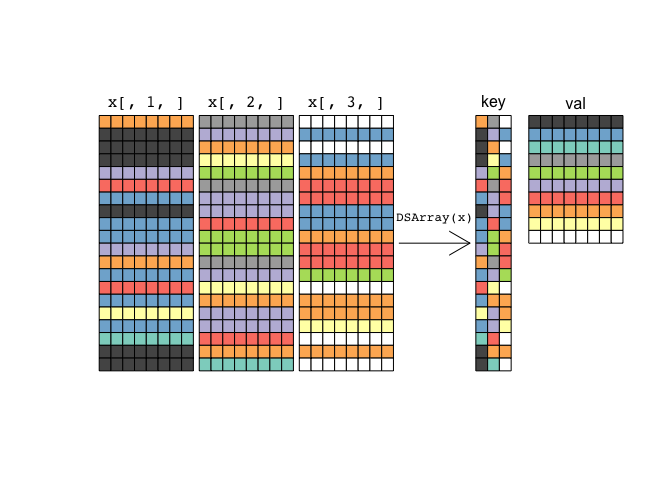

<!-- README.md is generated from README.Rmd. Please edit that file -->
[](http://www.repostatus.org/#wip) [](https://travis-ci.org/PeteHaitch/DSArray) [](https://ci.appveyor.com/project/PeteHaitch/DSArray) [](https://codecov.io/github/PeteHaitch/DSArray?branch=master)

R package: DSArray
------------------

DSArray ("*desiree*") provides efficient in-memory representation of 3-dimensional arrays with many duplicate slices via the DSArray (**D**uplicate **S**lice **Array**) S4 class. A basic array-like API is provided for instantiating, subsetting, and combining DSArray objects.

#### What the hell do I do with this?

This package serves a niche purpose. However, since I've found it useful, I'm making it publicly available. Here is the problem in words and a picture illustrating the solution that *DSArray* offers.

Suppose you have data on a set of `n` samples where each sample's data can be represented as a matrix (`x1`, ..., `xn`) where `dim(x1) = ... = dim(xn) = c(nrow, ncol)`. We can combine these matrices along a given dimension to form a 3-dimensional array, `x`. *DSArray* is designed for the special case where there are many duplicate *slices* of `x`. Continuing our example, if each of the `x1`, ..., `xn` have duplicate rows and we combine `x1`, ..., `xn` to form `x` such that `x[, j, ]` represents `xj`, then for this special case we can efficiently represent the data by storing only the unique rows of the `x1`, ..., `xn` and an associated index. A picture will hopefully help make this clearer:



We have `n = 3` matrices, each shown as a slice of `x` (`x[, 1, ]`, `x[, 2, ]`, `x[, 3, ]`) with `nrow = 20` and `ncol = 8`, where the colour of the row identifies identical rows. Note that the same row may be found multiple times within a sample and may also be common to multiple samples. We can construct the *DSArray* representation of `x` by calling `DSArray(x)`. The *DSArray* representation has a *key* and a *val*, much like an associative array, map, or dictionary. The j-th column of the *key* is the key for the j-th sample (note the colour ordering of each sample). The *val* contains all **unique** rows found in the `n` samples.

We can reconstruct the data for a particular sample by expanding the *val* by the relevant column of the *key*. We can often compute the required summaries of the data while retaining this sparse representation. In this way, a *DSArray* is similar to using a run length encoding of a vector or a sparse matrix representation to leverage the additional structure in the object[1].

### Install DSArray

You can get the development version from GitHub:

``` r
devtools::install_github("PeteHaitch/DSArray")
```

Demo
----

### Load *DSArray* and example data

This demo uses a small example dataset to demonstrate the API. However, it is only really beneficial to use a *DSArray* object instead of a `base::array` when the dimensions of the object are large and there are many duplicate slices (this is demonstrated at the end of the demo).

``` r
library("DSArray")
# TODO: Load data
```

-   Load some data
-   Show saving made by DSArray representation (`pryr::object_size()`)

### API

The *DSArray* API is written to mimic the `base::array` API so that as much as much as possible a *DSArray* can be used as a drop-in replacement for a `base::array` when the need arises.

-   Importantly, the *DSArray* API is writen to mimic the `base::array` API so that *DSArray* objects behave as if they were 3-dimensional `base::array` objects.
-   Show some operations on the DSArray representation and that result is identical to array representation
-   Demonstrate leveraging the sparse representation
-   Demo within SummarizedExperiment (save for vignette)
-   Comparison to ?`dgCMatrix-class` (save for vignette)
-   Plot of memory savings for different `nrow`, `ncol`, `n` and `duplicate_rate`.

### Overview of functions

-   Explain which functions are optimally implemented and show as table (save for vignette)

### Vignettes

An extended demonstration of *DSArray* demo can be found in the package vignette (**TODO**: Link to rendered version) including:

-   Using *DSArray* objects in a *SummarizedExperiment* object
-   A discussion of optimally implemented methods for *DSArray* objects
-   Future work

[1] *DSArray* objects are compared to sparse matrix objects in the package vignette (**TODO**: Link to rendered version) and shown to be useful for a special case I encountered.
